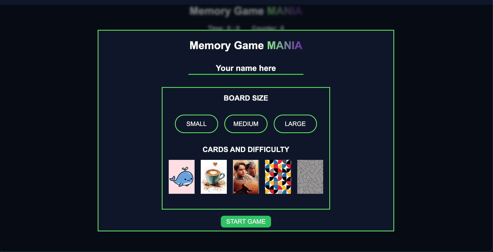
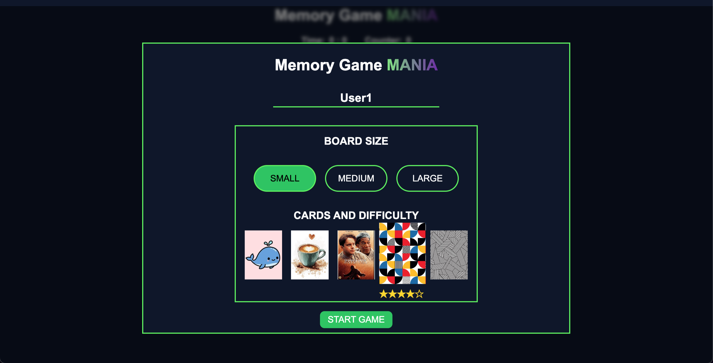
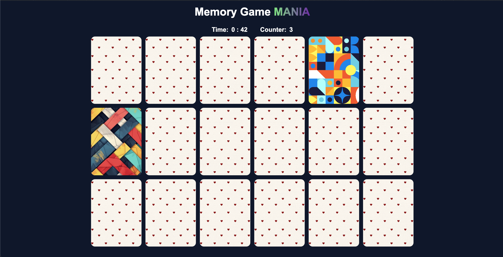

🧠 Memory Game MANIA

A full-stack, responsive memory matching game featuring multiple difficulty levels and themed decks.

<p align="center">
  
  
  
</p>

🚀 Getting Started
Follow these steps to get the project running on your local machine.

1. Prerequisites
   Ensure you have Node.js installed on your computer.

2. Installation
   Clone the repository and install the dependencies (including Express, Knex, and SQLite3):

Bash
`git clone <your-repo-url>`
`cd <your-project-folder>`
`npm install`

3.  Database Setup (Automated)
    The project uses SQLite. You do not need to manually create tables. I have included an initialization script that builds the database and seeds it with the game data (Movies, Animals, Patterns, etc.).

Run this command in your terminal:

Bash
`node init_db.js`

What this does:

🗑️ Drops any existing tables (Clean slate).

🏗️ Creates the Decks and Cards tables.

🌱 Seeds the database with 100+ card entries.

✅ Generates the card-decks.db file automatically.

4. Running the Project

Start the Backend (Server)
Bash
`node server.js`

The server will start on http://localhost:8080 (or your configured port).

Start the Frontend
Since the frontend uses ES Modules (import/export), you cannot open index.html directly from the file system.
You have two options for that:

1. VS Code: Right-click index.html inside the frontend/ folder and select "Open with Live Server".

2. Express Static: If your server.js is configured to serve static files, just navigate to http://localhost:8080 in your browser.

🛠️ Tech Stack
Frontend: HTML5, CSS3 (Modular Grid, Variables), Vanilla JavaScript (ES6+).

Backend: Node.js, Express.

Database: SQLite with Knex.js.

Shared Logic: ES Modules used for shared constants between client and server.

✨ Key Features
Themed Decks: Choose between Animals, Movies, Abstract, and more.

Dynamic Grid: Responsive layouts for Small (9 pairs), Medium (15 pairs), and Large (25 pairs) boards.

Project Structure

```
FoundationProject
├─ README.md
├─ backend
│  └─ server.js
├─ frontend
│  ├─ images
│  │  ├─ ...
│  ├─ index.html
│  ├─ js
│  │  ├─ fallback.js
│  │  ├─ game-state.js
│  │  ├─ modal.js
│  │  ├─ script.js
│  │  └─ timer.js
│  └─ styles
│     ├─ buttons-large.css
│     ├─ card.css
│     ├─ grid.css
│     ├─ keyframes.css
│     ├─ layout.css
│     ├─ modal.css
│     ├─ radio-button.css
│     ├─ reset.css
│     ├─ styles.css
│     ├─ typography.css
│     ├─ utility.css
│     └─ variables.css
├─ package-lock.json
├─ package.json
└─ shared
   └─ constants.js

```
